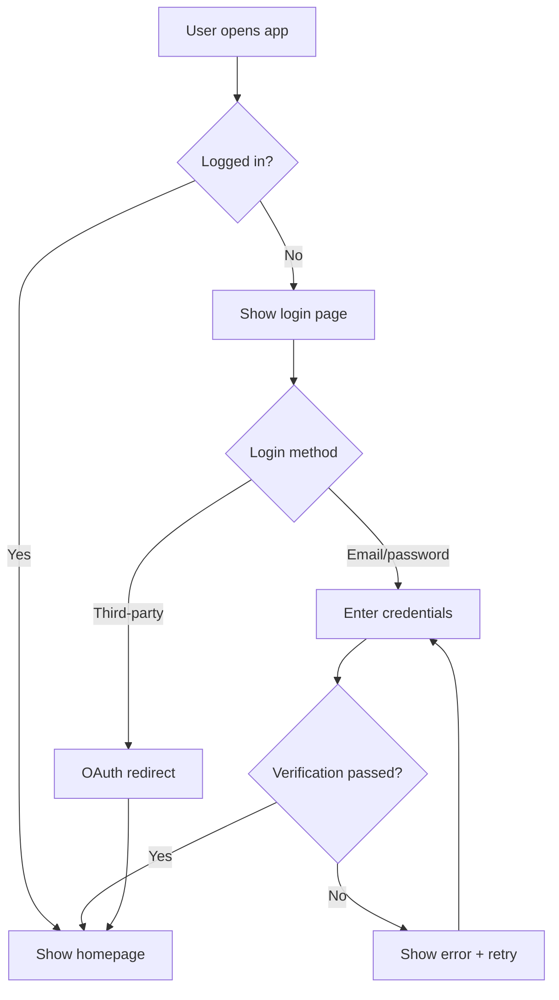
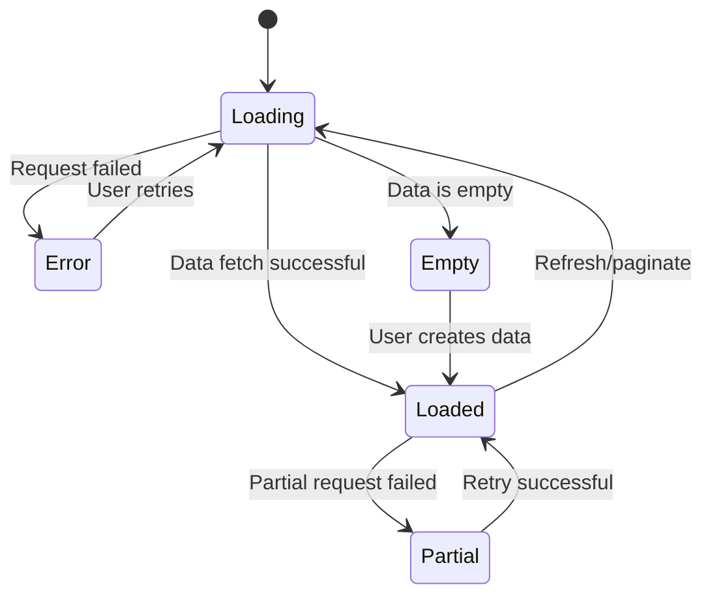

# Interaction Design Guide

## Design Process

Interaction design is not drawing wireframes — it's defining "how users converse with the product." Follow these steps:

### Step 1: Clarify Design Inputs

Before starting, answer these questions:

```
- Who are the target users? (Role, skill level, usage context)
- What is the user's core task? (Jobs to be Done)
- What does success look like? (Completion criteria)
- What constraints exist? (Technical, time, platform)
- What emotions will users bring? (Anxiety, curiosity, urgency)
```

### Step 2: Design User Flows

Use Mermaid flowcharts to describe the complete path from entry to task completion.

**Standards**:
- Each flow has one clear entry and at least one success exit
- Mark key decision points (diamond nodes)
- Mark exception/error paths (red or dashed lines)
- No path exceeds 7 steps (Miller's Law)

**Example**:


### Step 3: Design Page State Machines

Every key page/component should have a complete state machine covering all states.

**Five-State Principle**: Every page that requires data should cover at least these states:

| State | Description | Design Points |
|-------|-------------|---------------|
| **Loading** | Data loading | Skeleton preferred over Spinner; indicate expected wait time |
| **Empty** | No data | Guide users to create first entry; never blank page |
| **Loaded** | Normal display | Core experience, invest most design effort here |
| **Error** | Load/operation failed | Describe problem in plain language + provide fix action |
| **Partial** | Partial data/degraded | Show available data + mark missing parts |

**Mermaid state diagram example**:


### Step 4: Design Information Architecture

Information architecture defines "how content is organized and navigated."

**Principles**:
- **3-Click Rule**: Users should reach any core page within 3 clicks
- **7±2 Rule**: No more than 5-9 navigation items per level
- **Progressive Disclosure**: Show the most important first, expand details on demand
- **Breadcrumbs/Location Sense**: Users always know "where I am"

**Output format**:
```
App Name
├── Home (Dashboard)
│   ├── Overview cards
│   └── Quick actions
├── Core Module A
│   ├── List page
│   ├── Detail page
│   └── Edit page
├── Core Module B
│   └── ...
└── Settings
    ├── Account
    ├── Notifications
    └── Security
```

### Step 5: Define Interaction Details

For each key interaction, specify these details:

**Form Interactions**:
- Validation timing: On input (real-time) / On blur / On submit
- Error display: Field-level inline errors vs global toast
- Auto-save vs manual submit
- Form step splitting strategy (single page vs multi-step wizard)

**List Interactions**:
- Pagination vs infinite scroll vs virtual list
- Sort/filter/search interaction methods
- Batch operation triggers (checkboxes vs long-press)
- Empty search result handling

**Modal Interactions**:
- When to use Modal vs Drawer vs new page
- Close methods (X / Escape / click overlay / complete action)
- Whether it blocks background operations
- Nested modal handling strategy (avoid when possible)

**Animation & Transitions**:
- Duration: Micro-interactions 150ms, page transitions 200-300ms, complex animations 300-500ms
- Easing functions: ease-out (enter), ease-in (exit), ease-in-out (movement)
- Purposefulness: Every animation must serve to guide attention / express spatial relationships / confirm action feedback

## Interaction Design Checklist

Check each item before delivery:

- [ ] All user flow Happy Paths designed
- [ ] Exception paths and edge cases covered
- [ ] Every data page covers five states (Loading/Empty/Loaded/Error/Partial)
- [ ] Form validation rules and timing defined
- [ ] Destructive operations have confirmation or undo mechanism
- [ ] Animations have clear purpose and reasonable duration
- [ ] Keyboard can complete entire core flow
- [ ] Mobile gesture interactions considered
- [ ] Forward/back navigation logic between pages is clear
- [ ] First-time user onboarding designed (if needed)
