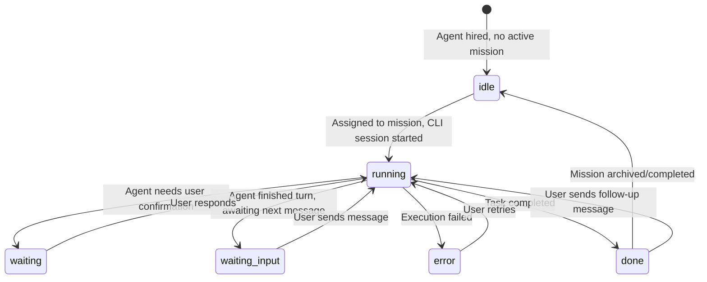
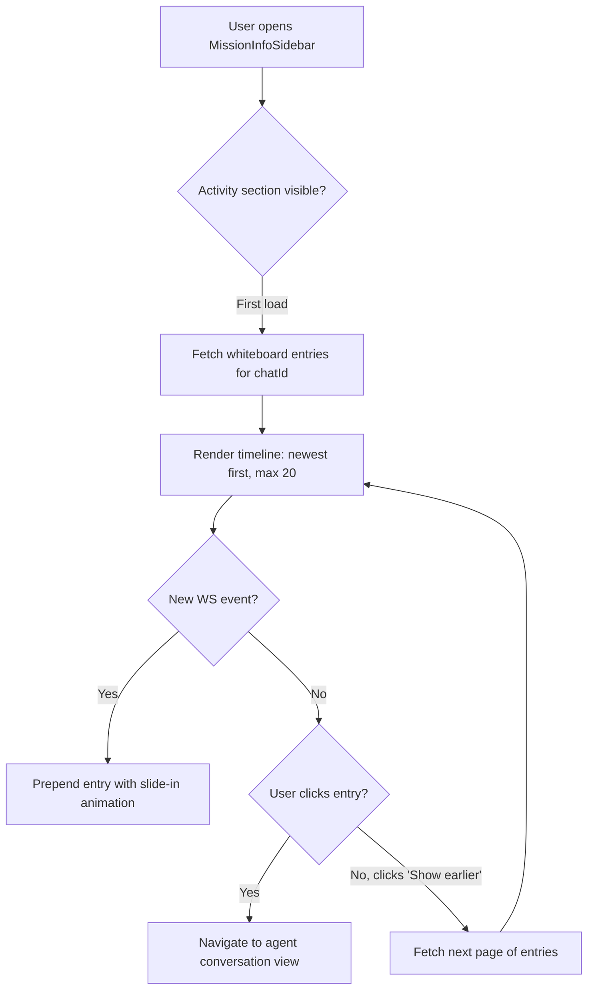

# Teammates Presence & Identity

> From "tool list" to "team members" — making AI agents feel like real collaborators with presence, personality, and track record.

## 1. Product Background & Problem Statement

### Current State

OpenTeam positions itself as "the operating system for AI super-individuals," where one person orchestrates multiple AI agents working in parallel. However, the current agent experience contradicts this promise:

- **Agents lack presence.** The WorkspaceHome "Your team" strip shows every agent with a static green dot labeled "online" — a lie. No indication of what each agent is doing right now, which mission they're working on, or whether they're blocked.
- **Agents lack identity.** Each agent is displayed as a name + one-line description. The rich personality data in SOUL.md (tone, verbosity, collaboration style) and IDENTITY.md (nickname, emoji, animal) is invisible to the user. There is no way to understand what an agent is *good at* before assigning it.
- **Agent selection is uninformed.** The AddAgentPicker is a flat, unranked list. No recommendation, no usage history, no indication of whether an agent is busy on another mission. Users must remember which agent to pick for which task.
- **Agent activity is opaque.** When the user returns from "leave mode," there is no timeline of what happened. War room entries (decisions, handoffs, artifacts) exist in the data layer but are not surfaced in a user-friendly way. The MissionInfoSidebar shows team members but no activity.
- **No trust accumulation.** There is no data that helps the user calibrate trust over time — no success rate, no completion time, no mission count. "Progressive trust" is a stated design principle with zero supporting UI.

### Why This Matters

The pulse-mode workflow (batch-dispatch → leave → batch-review) breaks without presence and activity signals. When a user returns, they cannot answer:
- Which agents are still working vs. done vs. stuck?
- What happened while I was away?
- Which agent should I assign to this new task?
- Is this agent reliable?

These questions force the user to click into every mission and read every conversation — exactly the attention drain OpenTeam promises to eliminate.

### Goals

1. **Agent presence is real-time and honest** — every surface that shows an agent also shows its true state (working on which mission / idle / error / waiting).
2. **Agent identity is rich and accessible** — users can quickly understand an agent's personality, skills, and strengths before and after assignment.
3. **Agent selection is informed** — the picker recommends agents based on task context, shows busy state, and surfaces usage patterns.
4. **Agent activity is browsable** — a timeline of key agent actions (handoffs, decisions, artifacts) is available per-mission so users returning from "leave" can catch up in seconds.
5. **Trust builds over time** — basic performance metrics help users calibrate expectations.

### Non-Goals

- Real-time collaborative editing between agents (out of scope — agents work in isolated sessions).
- Agent-to-agent chat visible to the user (handoffs are logged, not full conversations).
- Custom agent training or fine-tuning from the UI.
- High-fidelity analytics dashboards (P2 scope is intentionally lightweight).

---

## 2. User Scenarios & User Stories

### Persona: Solo AI Operator

A product builder who runs 3-5 missions concurrently, typically dispatching in the morning and reviewing in the afternoon. Uses OpenTeam daily, has built familiarity with the agent team over weeks.

### User Stories

#### US-1: Glanceable Team Status (P0)

> As a user returning from a meeting, I want to glance at the sidebar and instantly know which agents are working, which are stuck, and which are done — without clicking into any mission.

**Acceptance criteria:**
- Each agent row in the sidebar shows its real status (running/waiting/error/done/idle) via the existing status dot vocabulary.
- The WorkspaceHome "Your team" strip replaces the fake "online" label with each agent's actual state and current mission title (if any).
- If an agent is running, the strip shows a truncated one-liner of what it's doing (derived from `lastMessage` in `ChatMember`).

#### US-2: Agent Activity Timeline (P0)

> As a user coming back after 2 hours away, I want to open a mission and see a timeline of everything that happened — handoffs, decisions, artifacts, errors — without reading the full conversation.

**Acceptance criteria:**
- MissionInfoSidebar gains an "Activity" section showing whiteboard entries (type: decision, handoff, artifact, progress, open_question, constraint) in reverse chronological order.
- Each entry shows: icon by type, agent name (via `by` field), summary text, and relative timestamp.
- Handoff entries visually show "Agent A → Agent B" with a directional arrow.
- Entries are clickable to navigate to the relevant agent's conversation at that point (if applicable).

#### US-3: Agent Profile Card (P1)

> As a user considering which agent to add to a mission, I want to see the agent's personality, skills, and recent track record in a quick popover — not just its name and one-line description.

**Acceptance criteria:**
- Hovering or clicking an agent's avatar/name anywhere (sidebar agent row, AddAgentPicker, AgentsHub, WorkspaceHome strip) opens a profile card.
- The card shows: avatar, name, nickname, role tagline (from IDENTITY.md), personality summary (from SOUL.md), skill tags (from openteam.json `skills` array), and key stats (missions participated, last active).
- The card has a "View full profile" link to the AgentsHub edit/detail page.

#### US-4: Smart Agent Recommendation (P1)

> As a user adding an agent to a mission, I want the picker to recommend the most relevant agents at the top — not show a flat alphabetical list.

**Acceptance criteria:**
- AddAgentPicker sorts agents by a relevance score derived from: keyword match against mission title/description, recency of use, and frequency of use.
- Agents already in the mission are shown with a "In mission" badge and pushed below recommendations.
- Agents currently running in other missions show a subtle busy indicator (dot + "Working on: [mission title]").
- A "Recommended" section header appears above the top-ranked agents when a mission context is available.

#### US-5: Team Analytics (P2)

> As a user who has been using OpenTeam for a few weeks, I want to see basic performance data for each agent and my team overall — to know who's reliable and where bottlenecks are.

**Acceptance criteria:**
- AgentsHub Team tab shows per-agent stats: total missions participated, error rate (missions with at least one error / total), average duration (from `execution_logs`).
- A summary row at the top shows team-level stats: total missions, overall completion rate, average agents per mission.
- Stats are derived from existing `execution_logs` and `chats` tables — no new data collection needed for V1.

---

## 3. Functional Specification

### P0: Agent Presence

#### 3.1 Sidebar Agent Status (Enhancement to MissionSessionRows)

**Current:** `AgentRow` shows a status dot per agent using `memberStatusDot()`. This already works correctly for expanded mission rows.

**Change:** No sidebar row changes needed — the status dot system is already accurate. The improvement is in the *WorkspaceHome* team strip and the *AddAgentPicker*, which don't consume real status.

#### 3.2 WorkspaceHome Team Strip (Enhancement to WorkspaceHome.tsx)

**Current:** Static green dot + "N online" for all agents. No indication of what any agent is doing.

**Change:**

```
Before:
[Avatar] Fullstack ● (green, always)
[Avatar] Designer  ● (green, always)

After:
[Avatar] Fullstack ● (blue, pulsing) — "Implementing auth flow" (Mission: Ship OAuth)
[Avatar] Designer  ○ (gray)           — idle
[Avatar] Lead      ● (yellow)         — waiting for your input (Mission: Fix bug #42)
```

**Data source:** Aggregate `ChatMember` status across all active chats in the workspace. For each hired agent, find all `ChatMember` entries where `agentId` matches. Apply the same rollup priority as `chatStatusDot()` to determine the "global" status. The `lastMessage` field provides the activity subtitle. The parent chat's `title` provides the mission name.

**API change:** New endpoint `GET /api/workspaces/:id/agent-status` that returns:
```ts
interface AgentGlobalStatus {
  agentId: string
  status: ChatMemberStatus | 'idle'  // 'idle' when not in any active mission
  activeMission?: { chatId: string; title: string }
  lastMessage?: string
  lastActiveAt?: string
}
```

**Interaction:**
- Clicking an agent in the strip navigates to its active mission (if any), or opens the agent profile card (if idle).
- Status updates in real-time via the existing WebSocket push that broadcasts chat member changes.

#### 3.3 AddAgentPicker Busy Indicator (Enhancement to AddAgentPicker.tsx)

**Current:** Flat list, no status info.

**Change:** Each agent row shows a subtle status indicator:
- If agent is currently running in another mission: show `● Working on: [mission title]` in muted text below the description. This is informational, not blocking — users can still add a busy agent (a new instance will be created via `nextInstanceId`).
- If agent is idle: no extra indicator.

**Data source:** Same `AgentGlobalStatus` endpoint as 3.2, fetched once when the picker opens.

### P0: Agent Activity Feed

#### 3.4 Mission Activity Section (Enhancement to MissionInfoSidebar.tsx)

**Current:** MissionInfoSidebar shows Goal + Team list. No activity.

**Change:** Add an "Activity" section below the Team section. This section renders whiteboard entries for the current chat in a compact timeline format.

**Layout:**

```
ACTIVITY
─────────────────────────
● [decision] Lead · 2m ago
  "Use JWT over session tokens for auth"

↳ [handoff] Lead → Fullstack · 5m ago
  "Implement auth middleware"

◆ [artifact] Fullstack · 12m ago
  "server/middleware/auth.ts created"

⚠ [open_question] Fullstack · 15m ago
  "Redis dependency: add to stack?"
─────────────────────────
```

**Data source:** `GET /api/chats/:chatId/whiteboard?types=decision,handoff,artifact,progress,open_question,constraint&status=active` — this endpoint already exists in `whiteboardRoutes.ts`.

**Entry type visual mapping:**

| Type | Icon | Color |
|------|------|-------|
| `goal` | Target | `text-accent-brand` |
| `decision` | Circle (filled) | `text-accent-purple` |
| `artifact` | Diamond | `text-accent-green` |
| `progress` | Check | `text-accent-green/60` |
| `handoff` | Arrow-right | `text-accent-yellow` |
| `open_question` | Alert-triangle | `text-accent-red` |
| `constraint` | Lock | `text-text-muted` |

**Interaction:**
- Each entry shows agent name resolved via `agentNames[entry.by]`.
- Handoff entries parse the `refs.agents` field to show "Agent A → Agent B".
- Clicking an entry navigates to that agent's conversation view.
- Real-time updates via WebSocket: when the whiteboard broadcasts a new entry, the activity section appends it with a subtle slide-in animation.
- Maximum 20 entries visible by default; "Show earlier" link loads more.

### P1: Agent Profile Card

#### 3.5 Profile Card Component (New: AgentProfileCard.tsx)

A floating card (popover, not modal) triggered by click/hover on any agent avatar or name.

**Content:**

| Section | Source |
|---------|--------|
| Avatar (lg) + Name + Nickname | `agent-avatar.tsx` + IDENTITY.md (`name`, `nickname`) |
| Role tagline | IDENTITY.md `emoji` + first line of openteam.json `description` |
| Personality | SOUL.md `## Personality` section (first sentence only) |
| Tone badge | SOUL.md `## Tone` value (e.g., "casual", "formal") |
| Skill tags | openteam.json `skills` array, rendered as pill badges |
| Stats row | Missions: N | Last active: 2h ago |

**Data source:**
- Static identity data: new API endpoint `GET /api/agents/:id/profile` that reads IDENTITY.md + SOUL.md from the agent workspace and returns parsed fields. Response cached on server for 5 minutes.
- Stats: derived from `execution_logs` table — count of distinct `chat_id` where `agent_id` matches, and `MAX(completed_at)`.

```ts
interface AgentProfile {
  id: string
  name: string
  nickname: string
  emoji: string
  animal: string
  description: string
  personality: string     // first sentence of SOUL.md ## Personality
  tone: string            // value from SOUL.md ## Tone
  skills: string[]
  stats: {
    totalMissions: number
    lastActiveAt: string | null
  }
}
```

**Trigger points:**
- `AgentRow` in sidebar (click on agent name)
- `WorkspaceHome` team strip (click on avatar when idle)
- `AddAgentPicker` agent rows (hover delay 300ms, or click on avatar)
- `MissionInfoSidebar` team section (click on agent name)
- `AgentsHub` Team tab cards (click on avatar)

**Positioning:** Popover anchored to the trigger element, using existing popover/tooltip patterns in the codebase. Dismiss on click-outside or Escape.

### P1: Smart Agent Recommendation

#### 3.6 Recommendation Engine (Enhancement to AddAgentPicker.tsx)

**Current:** `filteredAgents` is a flat list filtered by search text only.

**Change:** When the picker opens with a `addAgentTaskId`, fetch the mission's title and description. Score each agent:

**Scoring algorithm (client-side, simple heuristic):**

```
score = keywordMatchScore + recencyScore + frequencyScore - busyPenalty

keywordMatchScore (0-50):
  - Count keyword overlaps between mission title and agent description + skills
  - Each match = 10 points, capped at 50

recencyScore (0-30):
  - Based on user's last time using this agent (from execution_logs)
  - Used in last 24h = 30, last 3d = 20, last 7d = 10, older = 0

frequencyScore (0-20):
  - Top 3 most-used agents get 20/15/10

busyPenalty (-10):
  - Agent currently running in another mission: -10
```

**Data source:** New endpoint `GET /api/agents/recommendation-context` returns:

```ts
interface AgentRecommendationContext {
  recentUsage: Array<{ agentId: string; lastUsedAt: string; usageCount: number }>
  globalStatus: AgentGlobalStatus[]
}
```

**UI changes:**
- When scores are available, agents sort by score descending.
- A "Recommended" section divider appears above agents with score > 30.
- "In this mission" badge for agents already assigned to the target chat.
- "Working on: [title]" subtitle for busy agents.

### P2: Team Analytics

#### 3.7 Team Stats Strip (Enhancement to AgentsHubPage.tsx)

**Current:** Team tab shows agent cards with name/description and Hire/Fire/Edit actions.

**Change:** Add a stats summary strip at the top of the Team tab:

```
TEAM OVERVIEW
Total Missions: 47 | Completion Rate: 89% | Avg Agents/Mission: 2.3
```

**Data source:** Aggregate from `chats` table (count, status distribution) and `execution_logs` (agent counts per chat). No new tables.

#### 3.8 Per-Agent Stats (Enhancement to AgentsHub Team tab cards)

Each agent card in the Team tab gains a small stats row:

```
[Fullstack Engineer]
End-to-end delivery from requirement analysis...
──────────
Missions: 23 | Errors: 2 (8.7%) | Avg time: 12m
```

**Data source:** `execution_logs` grouped by `agent_id`:
- `totalMissions`: `COUNT(DISTINCT chat_id)`
- `errorCount`: `COUNT(*) WHERE status = 'error'`
- `avgDuration`: `AVG(duration) WHERE status = 'completed'`

**API:** `GET /api/agents/stats` returns an array of per-agent stats. Computed on-demand (no background job). Cached 1 minute server-side.

---

## 4. Interaction Design

### 4.1 Information Architecture

```
WorkspaceHome
├── Activity Feed (existing — running/review/completed missions)
├── Your Team Strip (ENHANCED — real status + activity subtitle)
│   └── Click idle agent → Profile Card popover
│   └── Click active agent → Navigate to active mission
└── Templates (existing)

Sidebar (MissionSessionRows)
├── Mission Row (existing — status dot, agent count)
│   └── Expand → Agent Rows (existing — per-agent status dot)
│       └── Click agent name → Profile Card popover (NEW)
└── (no structural changes)

MissionInfoSidebar
├── Goal (existing)
├── Team (existing)
│   └── Click agent → Profile Card popover (NEW)
├── Activity (NEW — whiteboard timeline)
│   ├── Entry: decision / handoff / artifact / progress / open_question / constraint
│   └── "Show earlier" pagination
└── Add Agent (existing)

AddAgentPicker
├── Search (existing)
├── Recommended section (NEW — scored by relevance)
├── Agent rows (ENHANCED — busy indicator + "In mission" badge)
│   └── Hover avatar → Profile Card popover (NEW)
└── Footer (existing)

AgentsHub → Team Tab
├── Team Stats Strip (NEW — aggregate metrics)
├── Agent Cards (ENHANCED — per-agent stats row)
│   └── Click avatar → Profile Card popover (NEW)
└── Hire/Fire/Edit actions (existing)
```

### 4.2 Agent Presence State Flow



### 4.3 Activity Timeline Interaction Flow



### 4.4 Profile Card Trigger & Dismiss

- **Trigger:** Single click on agent avatar or name. No hover-to-open (avoids accidental popups in the sidebar where targets are small).
- **Exception:** In AddAgentPicker, hover with 300ms delay is acceptable because the picker is a focused modal with larger targets.
- **Dismiss:** Click outside, press Escape, or click another agent (replaces card).
- **Position:** Prefer right of trigger; fall back to left if near right edge. Card width: 280px.

---

## 5. Data Requirements

### 5.1 New API Endpoints

| Endpoint | Method | Purpose | Data Source |
|----------|--------|---------|-------------|
| `/api/workspaces/:id/agent-status` | GET | Global agent status across workspace | Join `chats` + `ChatMember` enrichment |
| `/api/agents/:id/profile` | GET | Agent identity + personality + stats | IDENTITY.md + SOUL.md + `execution_logs` |
| `/api/agents/stats` | GET | Per-agent performance metrics | `execution_logs` aggregate |
| `/api/agents/recommendation-context` | GET | Usage recency + frequency for ranking | `execution_logs` aggregate |

### 5.2 Existing Data Sources (No Schema Changes)

| Data | Table/Source | Notes |
|------|-------------|-------|
| Agent real-time status | `ChatMember` (in-memory, enriched by server) | Already computed; needs aggregation across chats |
| Whiteboard entries | `WhiteboardManager` JSONL files per chat | Already queryable via existing API |
| Agent identity | `ai-assets/agents/*/IDENTITY.md` | Parsed on demand, cached 5min |
| Agent personality | `ai-assets/agents/*/SOUL.md` | Parsed on demand, cached 5min |
| Agent skills | `openteam.json` `agents.list[].skills` | Already loaded at startup |
| Mission participation | `execution_logs.chat_id` grouped by `agent_id` | Existing table, new aggregation query |
| Error rate | `execution_logs.status` | Existing column |
| Duration | `execution_logs.duration` | Existing column |

### 5.3 WebSocket Events (Enhancement)

| Event | Payload | Trigger |
|-------|---------|---------|
| `agent-status-changed` | `{ agentId, status, chatId, lastMessage }` | When any `ChatMember` status changes |
| `whiteboard-entry` | `WhiteboardEntry` | Already exists — used by activity feed |

**Note:** `agent-status-changed` is a workspace-scoped broadcast. The existing `openteam:chat-updated` CustomEvent on the client side may be sufficient if enriched with member status deltas. Evaluate during implementation whether a new WS event type is needed or if the existing chat-update broadcast carries enough data.

### 5.4 No New Database Tables

All data derives from existing tables (`execution_logs`, `chats`, `agents`) and files (IDENTITY.md, SOUL.md, whiteboard JSONL). This is intentional — the feature layer surfaces data that already exists but is invisible.

---

## 6. Success Metrics

### Primary Metrics

| Metric | Definition | Target | Measurement |
|--------|-----------|--------|-------------|
| **Time to situational awareness** | Time from opening WorkspaceHome to understanding all agent states | < 3 seconds (visual scan) | User study / session recording |
| **Agent selection confidence** | % of missions where the user adds an agent without first visiting AgentsHub to "look them up" | > 70% (vs. current ~40% estimated) | Track AddAgentPicker → AgentsHub navigation patterns |
| **Catch-up efficiency** | Time from returning to OpenTeam to reviewing all pending missions | Reduce by 50% | Compare session patterns: mission click count before/after |

### Secondary Metrics

| Metric | Definition | Target |
|--------|-----------|--------|
| Profile card engagement | % of users who open at least one profile card per session | > 30% within 2 weeks |
| Activity feed scroll depth | Average entries viewed per mission visit | > 5 entries |
| Recommendation accuracy | % of missions where the top-recommended agent is actually selected | > 40% |

### Guardrail Metrics

| Metric | Constraint |
|--------|-----------|
| Sidebar render performance | No additional render latency > 16ms (1 frame) from status updates |
| API response time | All new endpoints < 200ms p95 |
| WS message volume | Agent status broadcasts < 2 messages/second per workspace under normal load |

---

## 7. Risks & Constraints

### Technical Risks

| Risk | Impact | Mitigation |
|------|--------|-----------|
| **Status aggregation performance** | Aggregating ChatMember status across all chats per workspace could be expensive with many active missions | The workspace typically has < 20 active chats. Server-side enrichment already iterates members. Add a lightweight in-memory cache (1s TTL) for the aggregated view. |
| **IDENTITY.md / SOUL.md parsing fragility** | Markdown structure may vary across agents; parsing could break on edge cases | Define a strict parser with fallbacks. If a field is missing, show "—" rather than crashing. Validate format on agent save. |
| **WebSocket broadcast volume** | Frequent status changes (especially during rapid tool calls) could flood the WS | Debounce status broadcasts: batch changes within a 500ms window. Only broadcast when the status *category* changes (running→waiting), not on every message. |
| **Stale recommendation context** | Usage data from execution_logs may not reflect very recent sessions | Acceptable for V1. Recommendation is a convenience, not a gatekeeper. Users can always manually search/select. |

### Product Risks

| Risk | Impact | Mitigation |
|------|--------|-----------|
| **Information overload** | Too many signals (status dots, activity entries, stats) could overwhelm rather than inform | Follow existing design language: muted colors for done/idle, attention-worthy colors only for actionable states (waiting, error). Activity feed defaults to collapsed with count badge. |
| **False sense of capability** | Profile cards may make agents seem more capable than they are, leading to misassignment | Personality/tone is informational, not a capability claim. Skills tags link to real skill definitions. Stats show actual performance, not promises. |
| **Analytics gaming** | Users might over-index on error rate, unfairly "firing" agents that tackle harder tasks | V1 analytics are intentionally simple. Avoid comparisons or rankings between agents. Present stats neutrally, not as leaderboards. |

### Design Constraints

- **Attention-first principle:** Every new UI element must justify the attention it demands. Status dots use the existing color vocabulary — no new colors. Activity entries use compact single-line format. Profile cards are dismissible popovers, not modals.
- **Leave-friendly:** The activity timeline is the primary "catch-up" mechanism. It must be scannable in under 10 seconds for a typical mission with 5-10 entries.
- **Existing component system:** All UI uses Tailwind + existing design tokens. No new dependencies for tooltips/popovers — use the existing popover primitives from `@/components/ui/`.
- **JSONL as source of truth:** Agent activity data comes from whiteboard JSONL, not from a new messages table. This is a hard architectural constraint per project rules.

### Implementation Phases

| Phase | Scope | Estimated Effort |
|-------|-------|-----------------|
| **P0 Sprint 1** | WorkspaceHome team strip with real status + MissionInfoSidebar activity feed | 3-4 days |
| **P0 Sprint 2** | AddAgentPicker busy indicator + WebSocket status broadcasts | 2 days |
| **P1 Sprint 3** | AgentProfileCard component + API endpoint + trigger integration | 3 days |
| **P1 Sprint 4** | Smart recommendation scoring + AddAgentPicker sort/sections | 2 days |
| **P2 Sprint 5** | Team analytics strip + per-agent stats | 2 days |

---

## Appendix A: Component Inventory (Affected Files)

| File | Change Type | Priority |
|------|------------|----------|
| `web/components/workspace/WorkspaceHome.tsx` | Enhance team strip | P0 |
| `web/components/workspace/MissionInfoSidebar.tsx` | Add activity section | P0 |
| `web/components/workspace/AddAgentPicker.tsx` | Add busy indicator + recommendation sort | P0/P1 |
| `web/components/workspace/AgentProfileCard.tsx` | **New component** | P1 |
| `web/components/workspace/MissionSessionRows.tsx` | Add profile card trigger to AgentRow | P1 |
| `web/pages/AgentsHubPage.tsx` | Add stats strip + per-agent stats | P2 |
| `web/hooks/useAgentGlobalStatus.ts` | **New hook** — fetch/subscribe to workspace agent status | P0 |
| `web/hooks/useAgentProfile.ts` | **New hook** — fetch agent profile data | P1 |
| `web/hooks/useWhiteboard.ts` | Enhance to support activity feed query | P0 |
| `server/routes/agent/agentRoutes.ts` | Add `/profile`, `/stats`, `/recommendation-context` | P0/P1/P2 |
| `server/routes/workspace/workspaceRoutes.ts` | Add `/agent-status` | P0 |
| `server/lib/agentProfileParser.ts` | **New** — parse IDENTITY.md + SOUL.md | P1 |

## Appendix B: Existing Status Dot Vocabulary (Reference)

From `MissionSessionRows.tsx` — all new surfaces must reuse these tokens:

| Color | Token | Meaning |
|-------|-------|---------|
| Blue (rippling) | `bg-accent-running` + `animate-ping-soft` | `running` |
| Yellow | `bg-accent-yellow` | `waiting` (confirmation block) |
| Yellow (soft) | `bg-accent-yellow/60` | `waiting_input` (turn idle) |
| Red | `bg-accent-red` | `error` |
| Green (muted) | `bg-accent-green/40` | `done` |
| Gray | `bg-text-muted` | `idle` / `stopped` |

## Appendix C: IDENTITY.md / SOUL.md Format Reference

**IDENTITY.md** (YAML frontmatter style):
```
name: Fullstack Engineer
nickname: Fullstack
emoji: ⚒️
animal: wolf
```

**SOUL.md** (Markdown with `## Section` headers):
```markdown
## Personality
Pragmatic and efficient fullstack engineer...

## Tone
casual — like an experienced colleague...

## Verbosity
concise — key steps and outputs are clear...

## Collaboration Style
Address other Agents by their short nickname...
```

The profile parser should extract the first sentence from `## Personality` and the value portion from `## Tone` (before the em-dash).
